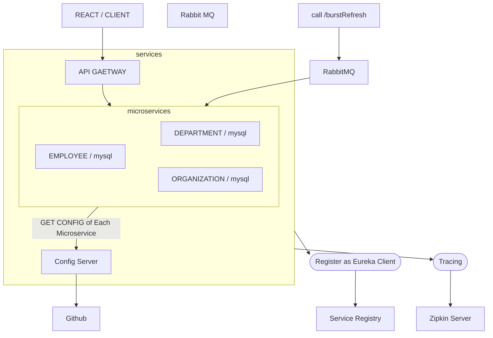

## What were utilized in this project?





## Running 
---

Order of Microservices Initialization
1. zipkin & rabbitmq
2. Service Registry
3. Config Server
4. Microservices(employee, department, organization)

config server(github repo): https://github.com/maxkangdev/config-server-git

### Start rabbitmq server(docker)
```
docker run --rm -it -p 5672:5672 rabbitmq:3.12.12
```

### Start zipkin server(docker)
```
docker run --rm -it --name zipkin -p 9411:9411 openzipkin/zipkin
```

